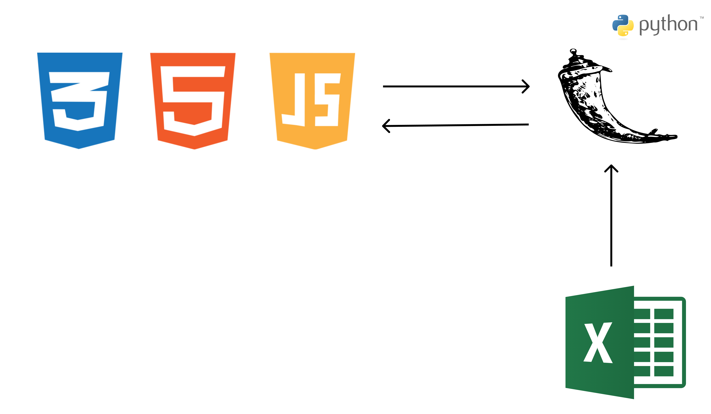

# [재난 알림이]

### 해당 서비스는 2024 경주 지역문제 해결 해커톤 [3전1안]의 프로젝트 입니다.

---
## 서비스 소개
### [재난 알림이]
- [재난 알림이]은 경주지역의 실시간 재난에 대해 알려주고, 사용자의 위치와 재난 상황에 맞게 대피소를 찾아주는 서비스입니다.
- 웹페이지로 제작하여 모바일에서도 쉽게 접속이 가능합니다.
- 재난 뿐만아니라 화재, 사고 등의 정보도 반영되어 재난 상황 이외에도 다양한 정보를 보여줍니다.

---
## 기능

- 실시간으로 경주의 재난 상황을 웹페이지로 알림
- 사용자 위치기반으로 위험지역을 우회하여 대피로 및 대피소 추천
- 각종 재난의 위험 구간을 알림
- 추후 어플리케이션 개발 및 휴대전화에 위치기반으로 재난 정보와 대피소 정보를 전송

---
## 서비스 아키텍처(예시)

---
## 사용 기술(예시)
| **Category**         | **Technologies** |
|----------------------|------------------|
| **Frontend**         | html, css        |
| **Backend**          | javascript       |
| **devops**           | localhost        |
| **Others**           | Github           |

---
## 팀원 소개
| **이진욱**            | **임성준** | **김준백** | **안창혁** |
|-----------------------|------------|-------------|------------|
| 팀장(Leader), Frontend| Frontend | Backend, devops | Backend |
